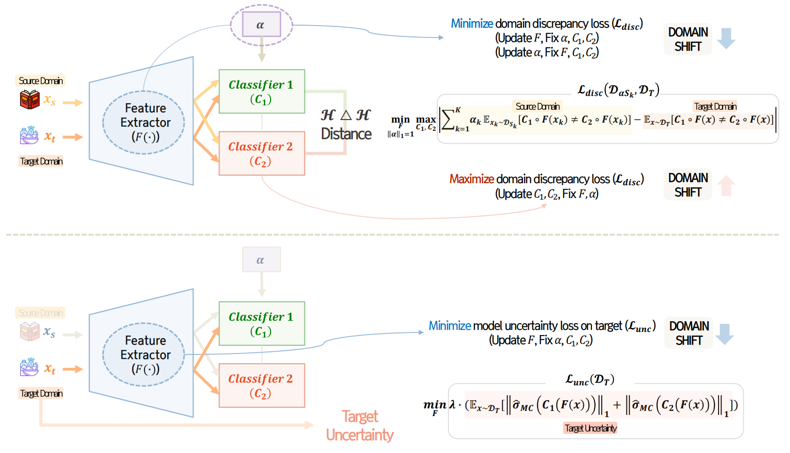

# BURMUDA
  

This is an implementation of BURMUDA(Bayesian Uncertainty-based Multi-source Unsupervised Domain Adaptation for Sentimental Analysis) in Pytorch.

## Requirements  
This part explains how to reproduce the BURMUDA sentiment analysis experiments in the paper.
* `torch == 1.12.1`
* `torchmetrics==0.11.4`
* `Python == 3.10`
* `numpy==1.23.5`
* `pandas==1.5.3`
* `tensorboard==2.12.0`
* `tqdm==4.64.1`
* `matplotlib==3.7.0`
* `easydict==1.10`
* `rich==12.6.0`
* `scikit-learn==1.2.1`
* `scipy==1.10.1`
* `seaborn==0.12.2`
* `colorama==0.4.6`  

## Training + Evaluation
Run
```python
python main.py
```

